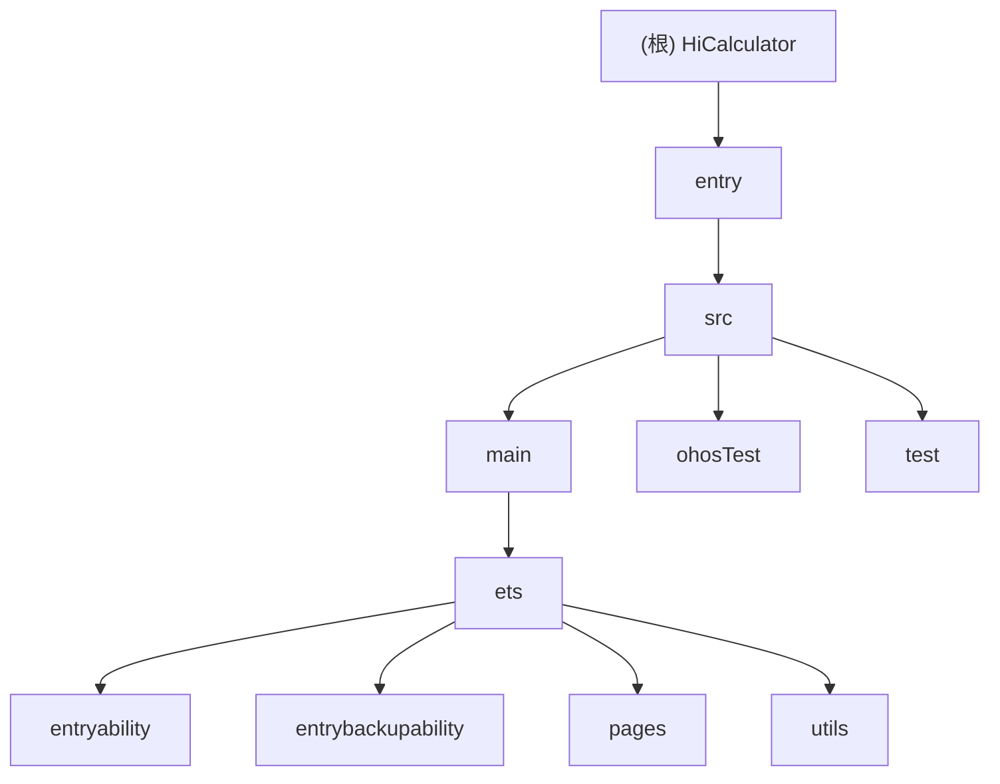

# CLAUDE.md

## 变更记录 (Changelog)

- **2025-12-03**: 更新项目架构文档，增加模块结构图和详细模块说明。

## 项目愿景

HiCalculator 是一个基于 HarmonyOS 的计算器应用，支持实数和复数运算，具备表达式求值功能。应用采用 ArkTS 语言开发，利用调度场算法处理运算符优先级，提供直观易用的用户界面。

## 架构总览

### ✨ 模块结构图



### 模块索引

| 模块路径 | 一句话职责 |
|---------|------------|
| [entry](./entry/CLAUDE.md) | 主模块，包含应用的主要功能实现 |
| [entry/src/main/ets/entryability](./entry/src/main/ets/entryability/CLAUDE.md) | 应用入口能力 |
| [entry/src/main/ets/entrybackupability](./entry/src/main/ets/entrybackupability/CLAUDE.md) | 应用备份能力 |
| [entry/src/main/ets/pages](./entry/src/main/ets/pages/CLAUDE.md) | 页面组件 |
| [entry/src/main/ets/utils](./entry/src/main/ets/utils/CLAUDE.md) | 工具类，包括复数计算和表达式求值 |

## 运行与开发

### 开发环境

- **开发框架**: HarmonyOS
- **编程语言**: ArkTS (TypeScript 的超集)
- **构建工具**: Hvigor
- **包管理器**: OHPM (OpenHarmony Package Manager)

### 常用命令

#### 构建和运行
```bash
# 构建项目
hvigor assembleHap

# 清理构建
hvigor clean
```

#### 代码检查
```bash
# 运行代码检查
hvigor lint
```

#### 测试
```bash
# 运行单元测试
hvigor test
```

## 测试策略

项目使用 Hypium 测试框架进行单元测试，包含本地单元测试和系统测试。

- **本地单元测试**: `entry/src/test/`
- **系统测试**: `entry/src/ohosTest/`

## 编码规范

项目遵循 HarmonyOS 和 ArkTS 的编码规范，使用声明式 UI 语法，通过资源文件管理颜色、字体等界面元素。

## AI 使用指引

当使用 AI 辅助开发时，请注意：

1. 遵循现有代码风格和架构设计
2. 保持复数计算和表达式求值的核心逻辑不变
3. 注意资源引用格式和模块导入方式
4. 确保新增功能与现有 UI 设计保持一致